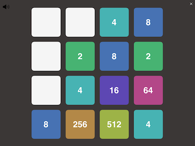

# GAMES TO RUN WITH PYTHONISTA-APP (iOS)

This is a collection of small Python games designed to be played on an iPhone or iPad using the Pythonista app.

## Games Included

### 1. photo_slider_puzzle
**Photo slider puzzle** is the digital recreation of the old small plastic puzzles used to keep the kids occupied when traveling. You can shift one tile at a time by tapping it. Feel free to increase the puzzle size (tile amount). Each refresh a new picture is fetched from [picsum](https://picsum.photos)

This game uses the Scene-Module and will work on iPhone and iPad.

### 2. ColorCatcher.py
**ColorCatcher** is an interactive game where you use the motion sensors of your phone or tablet to match a target HSV color. The X, Y, and Z axis movements correspond to different values in the HSV color model. I designed this game to encourage playful movement and keep my back active with big movement using arm and upper body. You can be "efficient" and only move your hand but that's less fun and less benefits. It's a simple but engaging way to add a bit of physical activity to your day!

### 3. FourInARow.py
**Four in a Row** (also known as Connect Four) is a classic two-player console game. Players take turns dropping their tokens into a grid, aiming to connect four tokens in a row, either horizontally, vertically, or diagonally. The game is fully playable in the Python console. Feel free to change the board size.

### 4. TicTacToe.py
**Tic Tac Toe** is another timeless two-player game. This is a console version. Players take turns placing their marks, trying to align three in a row, whether horizontally, vertically, or diagonally. It's a quick and fun game, perfect for short sessions.

### 5. RockPaperScissors.py
**Rock Paper Scissors** as a console game for one player. Try to beat the odds in this classic.

### 6. CodeCracker.py
**Code Cracker** is a console game for one player. Try to find the random 5-letter word using the colored feedback. The secret word is fetched from https://random-word-api.herokuapp.com. Default language is German. Other supported languages for the secret word are ["fr","it","es"].

### 7. 2048.py
**2048** for iPhone and iPad. 2048 is a simple puzzle game. Swipe right, left, up and down to move all tiles.
Tiles with the same number merge into one, doubling their value and a new tile (2 or 4) appears
randomly in an empty spot on the grid. You win when you reach 2048. You lose when there are no
more valid moves.

I added a subtle sound to the moves. You can mute it in the upper left corner.

 

## Requirements

- Pythonista app (iOS, http://www.omz-software.com/pythonista/ ) 

## How to Play

1. Clone or download this repository to your Pythonista app.
2. Open any of the Python files.
3. Run the script and enjoy!

## Why I Built These Games

- **ColorCatcher** was created as a fun way to incorporate movement and keep my back active, turning everyday stretches into a playful experience.
- The others were built for the nostalgia and as a fun coding excercise.

Enjoy the games!
